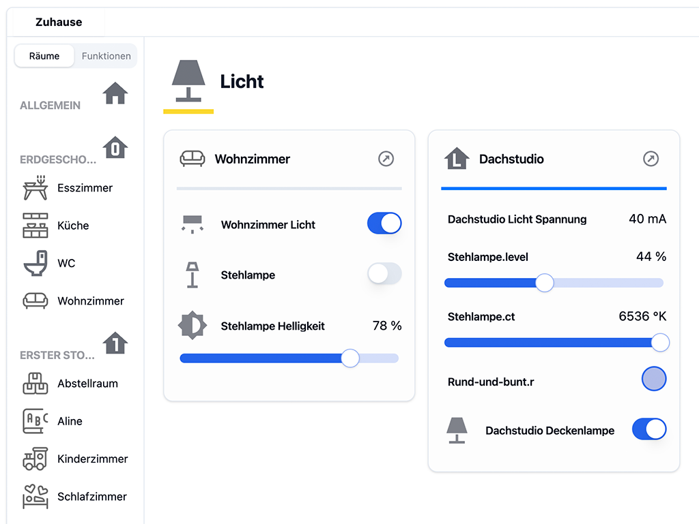
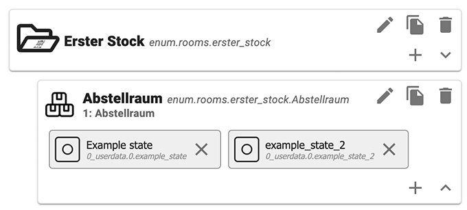
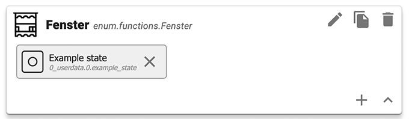

# ioBroker.visionary-ui

**Tests:** 

## visionary-ui adapter for ioBroker

🌟 Getting Started
---------------

### 📚 Prerequisites

* **ioBroker Installation**: Visionary-UI is an adapter for ioBroker. Ensure you have ioBroker installed and running.

### ⚙️ Configuration

* **Enum Definitions**: Use the ioBroker feature to define the enums "rooms" and "functions". These are crucial for the
  automatic detection of states in the Visionary-UI.
* **State Mapping**: Visionary-UI operates on the state level of the ioBroker hierarchy. Map the states you wish to
  monitor or control to at least one "room" and one "function". For instance, map a lightbulb in the living room to the
  enum "living room" and the function "light".
* **Enum Levels**: Currently, enums can be organized into two levels (parent, child). Deeper nesting is not yet
  supported.

**Rooms**

**Functions**

💡 Supported Devices and States
----------------------------

Visionary-UI currently supports various device types at the state level:

* **Read-Only Sensor Data**: Sensors or values that are not writable.
* **Buttons**: Boolean value items with a role equal to "button".
* **Switches**: Boolean value items with roles different from "button".
* **Level/Meters**: Editable via a slider component. These are number datatype values with defined minimum and maximum,
  and their role contains the string "level".
* **Dedicated Values**: Selectable via select boxes. These are number datatype values with dedicated states or without
  minimum and maximum definitions.
* **RGB Light Control**: Utilize "level.color.red", "level.color.green", "level.color.blue", and group them for a color
  selector component with the role "light.color".

💻 WebSockets and Webinterface
---------------------------

Visionary-UI uses a direct websocket connection to ioBroker. For that it assumes, ioBroker is available on localhost.
Other connection types different from that are not supported.

The websocket port will automatically be chosen by adding +1 to the port definition of the webinterface providing the
UI.
The UI currently does not support SSL/TLS for provisioning. The most common use case is to run it behind a reverse proxy
providing this feature. It's on my list of future tasks to support the SSL/TLS handling provided by ioBroker itself.

🤝 Feedback
----------

Your feedback and contributions is valuable to me. If you encounter any issues or have suggestions for improvements,
please feel free to open an issue.

### 📜 Scripts in `package.json`

Several npm scripts are predefined for your convenience. You can run them using `npm run <scriptname>`
| Script name | Description |
|-------------|-------------|
| `build` | Compile the TypeScript and React sources. |
| `watch` | Compile the TypeScript and React sources and watch for changes. |
| `build:ts` | Compile the TypeScript sources. |
| `watch:ts` | Compile the TypeScript sources and watch for changes. |
| `build:react` | Compile the React sources. |
| `watch:react` | Compile the React sources and watch for changes. |
| `test:ts` | Executes the tests you defined in `*.test.ts` files. |
| `test:package` | Ensures your `package.json` and `io-package.json` are valid. |
| `test:unit` | Tests the adapter startup with unit tests (fast, but might require module mocks to work). |
| `test:integration` | Tests the adapter startup with an actual instance of ioBroker. |
| `test` | Performs a minimal test run on package files and your tests. |
| `check` | Performs a type-check on your code (without compiling anything). |
| `coverage` | Generates code coverage using your test files. |
| `lint` | Runs `ESLint` to check your code for formatting errors and potential bugs. |
| `translate` | Translates texts in your adapter to all required languages,
see [`@iobroker/adapter-dev`](https://github.com/ioBroker/adapter-dev#manage-translations) for more details. |
| `release` | Creates a new release,
see [`@alcalzone/release-script`](https://github.com/AlCalzone/release-script#usage) for more details. |

## 📅 Changelog

<!--
    Placeholder for the next version (at the beginning of the line):
    ### **WORK IN PROGRESS**
-->

### **WORK IN PROGRESS**

* (ljouon) initial release

## 📄 License

MIT License

Copyright (c) 2023 Lars Jouon

Permission is hereby granted, free of charge, to any person obtaining a copy
of this software and associated documentation files (the "Software"), to deal
in the Software without restriction, including without limitation the rights
to use, copy, modify, merge, publish, distribute, sublicense, and/or sell
copies of the Software, and to permit persons to whom the Software is
furnished to do so, subject to the following conditions:

The above copyright notice and this permission notice shall be included in all
copies or substantial portions of the Software.

THE SOFTWARE IS PROVIDED "AS IS", WITHOUT WARRANTY OF ANY KIND, EXPRESS OR
IMPLIED, INCLUDING BUT NOT LIMITED TO THE WARRANTIES OF MERCHANTABILITY,
FITNESS FOR A PARTICULAR PURPOSE AND NONINFRINGEMENT. IN NO EVENT SHALL THE
AUTHORS OR COPYRIGHT HOLDERS BE LIABLE FOR ANY CLAIM, DAMAGES OR OTHER
LIABILITY, WHETHER IN AN ACTION OF CONTRACT, TORT OR OTHERWISE, ARISING FROM,
OUT OF OR IN CONNECTION WITH THE SOFTWARE OR THE USE OR OTHER DEALINGS IN THE
SOFTWARE.